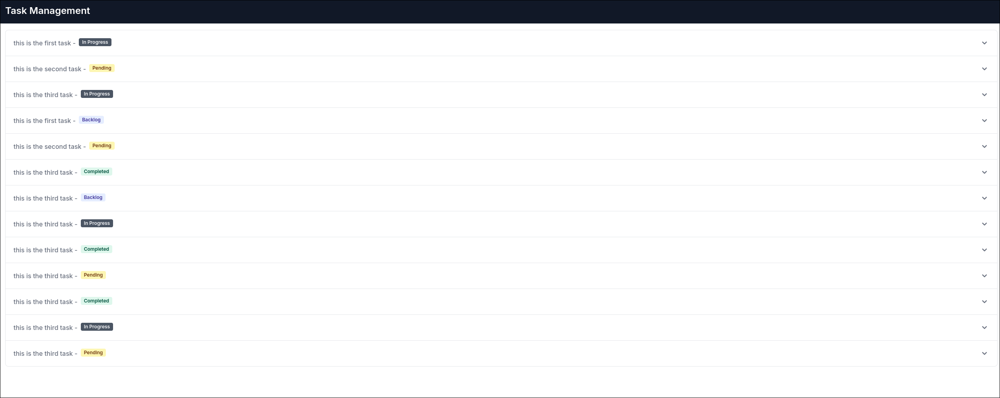

# Application Installation Guide

Follow these steps to set up and run the application locally.

## Prerequisites
1. **Git**: Download and install Git from [here](https://git-scm.com/).
2. **Docker**: Download and install Docker from [here](https://www.docker.com/).
3. Node Version Manager (NVM): Install NVM to manage Node.js versions. Follow the instructions here.
4. PHP Composer: Install PHP Composer globally. Follow the instructions here.

## Installation Steps

1. **Clone the Repository**
   
   ```bash
   git clone https://github.com/heshamadeldwedar/palm-outsourcing-challenge
   cd palm-outsourcing-challenge
   ```
2. **Install Composer Dependencies**
   
   Run the following command to install PHP dependencies using Composer:
   
   ```bash
   cd backend
   docker container exec <backend_SHA> composer install
   ```

3. **Install frontend dependencies
   Run the following command to install Node dependencies using NVM:
   
   ```bash
   cd ../frontend
   nvm install latest
   nvm use latest
   npm install
   ```

4. **Start Docker Compose**
   
   Run the following command to start the Docker containers:
   
   ```bash
   cd ..
   docker compose up -d
   ```


5. **Run Database Migrations**
   
   Execute the following command to run database migrations:
   
   ```bash
   docker container exec <backend_SHA> php artisan migrate
   ```

6. **Run Database Seeder**
   
   Seed the database with initial data:
   
   ```bash
   docker container exec <backend_SHA> php artisan db:seed --class=TaskSeed
   ```


7. Go to `localhost:3000` 

---

## Note
If you need to get SHA for backend execute the following command, make sure the backend container is running before doing this tho

```bash
# This for backend 
docker container ls | grep backend | awk '{print $1}' 
```

---

## Project Structure and Technologies Used:
### Monorepo Setup:
- Backend: Laravel
- Frontend: Next.js
- Database: Docker
- Communication: Docker Compose

### Backend Design:
#### Database Design:
- Two Tables: Task and Task Status (Badges) with Badge Color
#### Architecture:
- Controller, Service, and Model approach for simplicity and organization

### Frontend Design:
#### Next.js Application:
Server-rendered page with two client components:
- Empty state display
- List view state display

#### Responsiveness:
- Utilized Tailwind CSS for a responsive design

## Summary:
> The project utilizes a monorepo structure to house the Laravel backend, Next.js frontend, and Dockerized database. The backend features a simple database design with a Task and Task Status table. It follows a clear separation of concerns using controllers, services, and models. On the frontend, a server-rendered Next.js application with client components for different states ensures a smooth user experience. Tailwind CSS was employed for responsive design. 

---

## Application Screenshots

### Desktop View


### Mobile View
